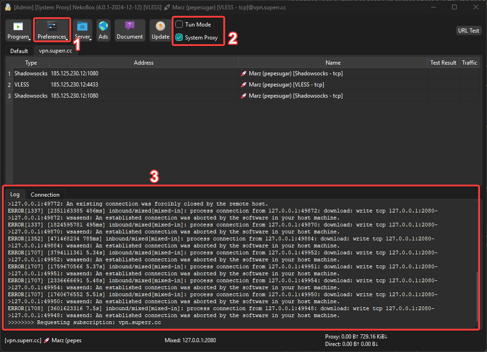
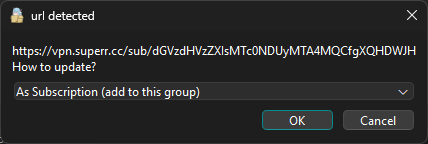
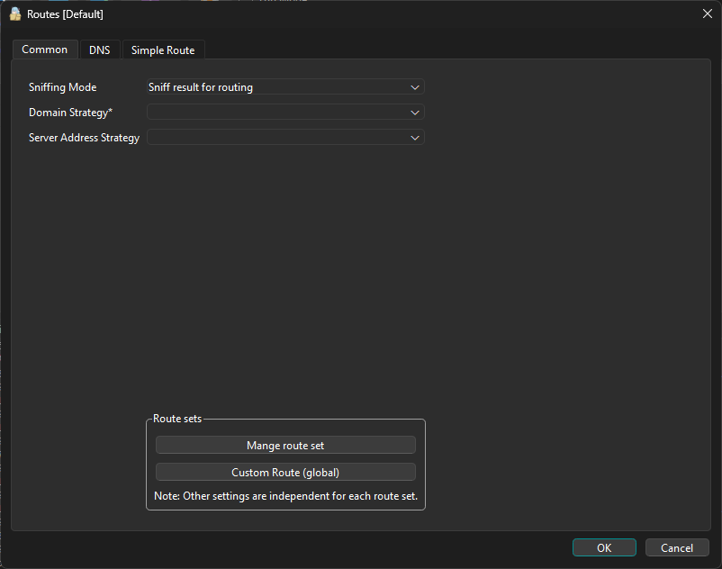
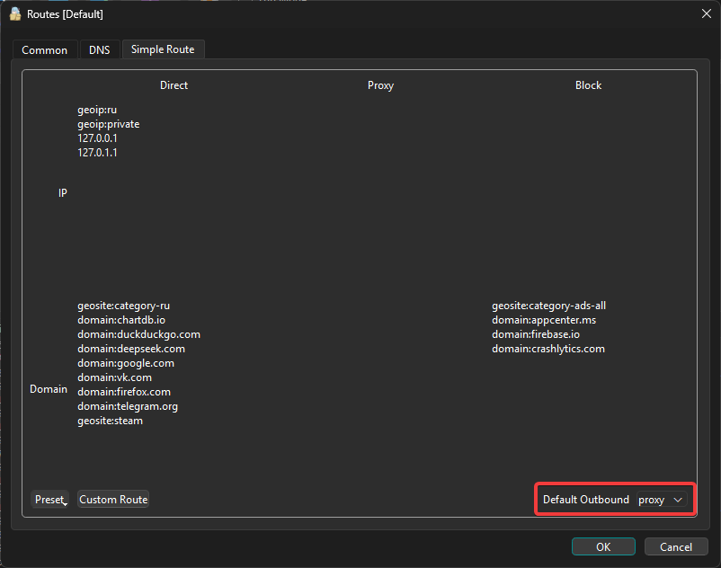
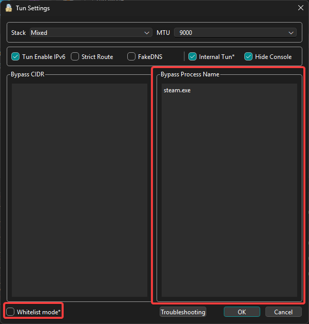
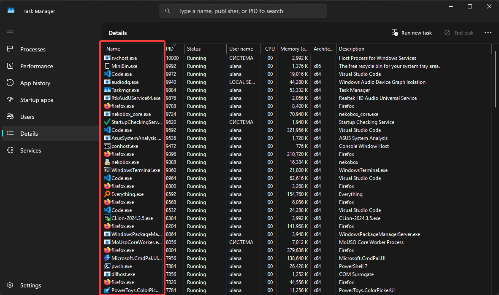

# Гайд по использованию Nekoray на ПК

## Установка

1. [С официального GitHub](https://github.com/MatsuriDayo/nekoray/releases/tag/4.0.1)

    - Для Windows скачать архив, распаковать в удобную директорию (желательно без русских букв и пробелов в пути)
    - Для Linux скачать AppImage (для запуска можно запустить скачанный файлик)

## Использование

Главное окно программы:

После установки программы панель лога (3) и центральная панель с доступными серверами будут пусты.

- Режим прокси перенаправляет трафик быстрее, но некоторые заблокированные приложения или сайты могут не работать

    - Обычный прокси (без галочек) в большинстве случаев придётся прокидывать в приложения самостоятельно
    - Системный прокси обычно подтягивается в приложения сам

- Режим TUN надёжнее, но медленнее (требует обязательной админки)

### Добавление ключей

Для добавления серверов копируем ключ и просто вставляем (ПКМ на панель серверов -> вставить).

1. Если ключ подписочный, при добавлении может всплыть окно, как на картинке .

    В этом случае можно либо оставить как есть и нажать ОК, но предпочтительный вариант - создать новый профиль (create new group)

    Также следует выключить режим системного прокси, так ключ не импортируется

### Маршрутизация

Теперь разберёмся с маршрутизацией

1. Открываем в главном окне Настройки (1) -> Настройки маршрутов (routing settings)

    

2. Переходим на третью вкладку (базовые маршруты, simple route) и смотрим в правый нижний угол

    
    

3. Выбираем интересующий нас режим выхода:

    - "Прокси" - по умолчанию все подключения идут через программу. Полезно, если нужно прогонять через VPN/Proxy очень много сайтов
    - "Напрямую"/"Bypass" - по умолчанию все подключения будут идти напрямую.Полезно, если требуется подключаться через VPN/Proxy только в особых случаях
    - "Блокировать"/"Block" - по умолчанию блокировать подключения. В большинстве случаев бесполезно

4. Заполняем таблицу. В зависимости от того, какой режим был выбран в предыдущем пункте, заполнять следует по-разному. Поэтому разберём лишь общую структуру (опираемся на [картинку](#sroutes))

    1. Колонки таблицы обозначают, какие пакеты пропускать без VPN/Proxy, какие проксировать и какие блокировать (именно в этом порядке).

    2. Строки таблицы обозначают IP-адреса (числовые) и доменные адреса (человеческие слова).

        - В IP можно писать:

            - IPv4 (192.168.1.1)
            - IPv6 (2607:f8b0:4005:0805::200e)
            - группы адресов в формате `geoip:ru` (конкретно эта обозначает все российские IP)

        - В домены можно писать:
            - домены первого уровня (`domain:ru`, `domain:org`)
            - домены второго уровня (`google.com`, `domain:vk.com`)
            - группы доменов (`geosite:reddit`, `geosite:category-ru`)

    > **ВАЖНО**: пробелы писать нельзя

### Настройка для приложений (только TUN)

Для обхода некоторых блокировок не хватит простого перенаправления трафика, которым мы занимались в предыдущем пункте. Например, Discord, Telegram и многие похожие приложения имеют собственные протоколы передачи данных, работать с которыми нужно особым образом.

1. Открываем в главном окне Настройки (1) -> Настройки TUN

    

2. В левом нижнем углу есть галочка.

    - Если она выключена, то IP в левой колонке и процессы в правой будут идти туда, куда должны изначально, без перенаправления на VPN
    - Включённая галочка перенаправляет только указанные в окне TUN маршруты

    В примере, пакеты от `steam.exe` будут проходить так, как будто никакого TUN и VPN впринципе не существует

3. Заполняем таблицу

    - В левой колонке указываем пулы IP-адресов в формате `192.168.1.0/24`
    - В правой колонке указываем имена процессов (то есть запускаемых файлов программ). Посмотреть их можно в диспетчере задач

        

4. Для ускорения DNS-запросов можно включить галочку FakeDNS
